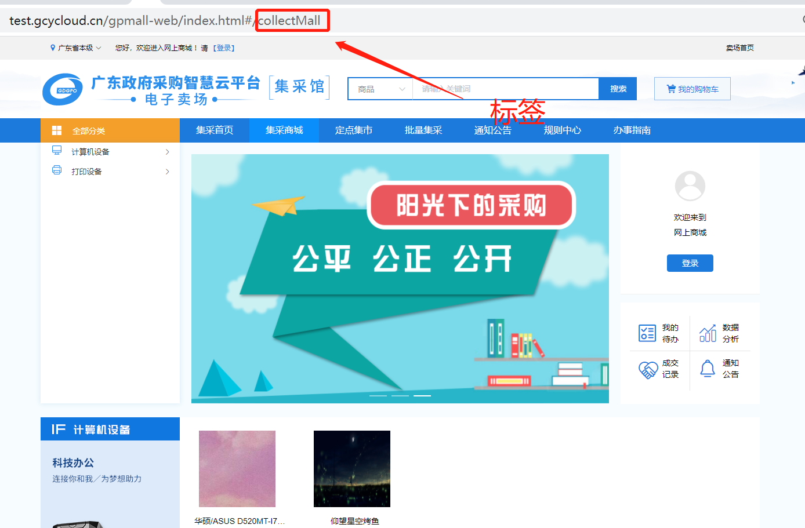
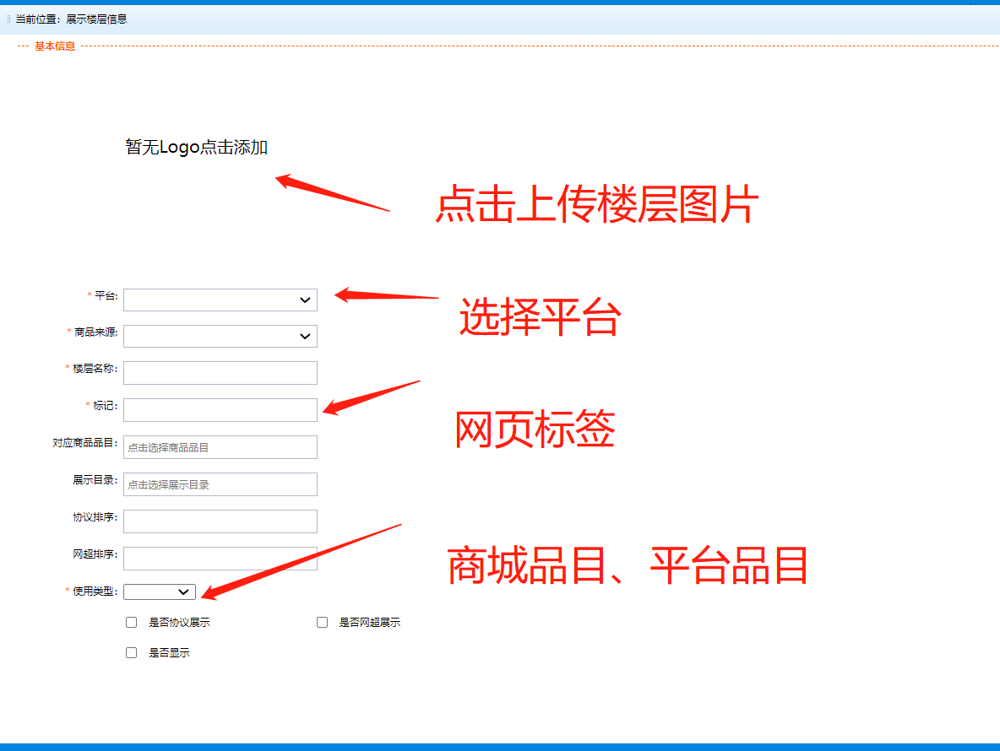

# 楼层配置说明

## 1.关键字

楼层配置

## 2.机制说明

在电子卖场首页及各场馆首页中，往往存在一些像楼层一样的产品分类，以方便采购人对商品各快速检索及定位。为方便快速实施，增加楼层的配置功能。

楼层通过标签的方式进行配置，其中标签可以理解为一个特定的页面。我们直接针对指定的页面进行配置。例如：

其中**collectMall**称之为标签。在配置功能中，我们针对标签进行配置。

前提条件：页面支持楼层。

## 3.配置说明

特殊说明：目前配置功能保留前后端分离前配置功能。