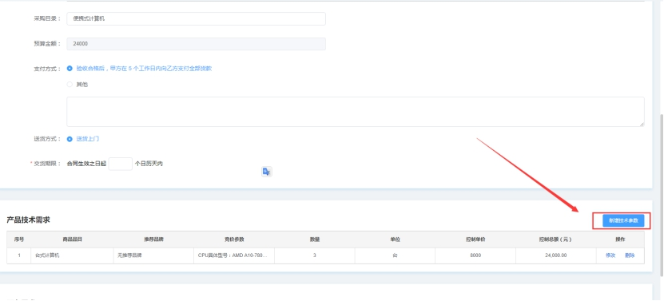
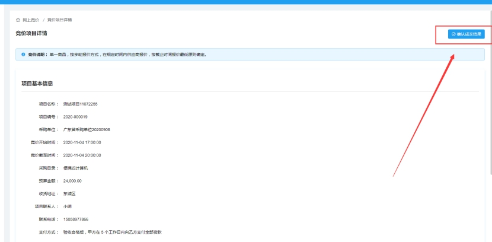

# 多品牌竞价功能说明

## 1.业务概述

### 1.1.关键字

标准商品库、参数模板、服务模板、多品牌、参数比对、大小比较。

### **1.2.** 功能说明

网上竞价依据标准商品库及标准参数模板，实现竞价项目需求标准化；供应商根据标准商品库对商品进行响应。

### **1.3.** 业务说明

采购人以参数配置形式提出采购需求发起竞价，有能力的供应商自愿参与，价低者得。具体规则如下：

1. 采购人依托集采商城商品库中的参数模板提出采购需求；每项需求可设定不少于3个意向品牌，不设置则视为任意品牌商品均可接受；

2.  有能力的供应商可自愿参与竞价，选取可满足采购需求的商品提交报价；

3.  报价时间3小时，在此时间段内，经销商可更改报价，以最后一次为准。供应商对报价响应内容的真实性承担法律责任；

4. 报价时间截止后，报价品牌及供应商不少于三家，则系统将报价供应商排序后，由采购人确认成交供应商；报价品牌及供应商不足三家，则竞价项目失败；

## **2.** 业务流程

 

流程说明：

1. 采购人新建项目，依据采购计划，按照商品类目的需求模板填写采购需求；

2. 采购人发布竞价公告。公告时长不小于三个工作日；

3. 公告期内采购人可以选择是否中止项目，中止原因（取消采购、需求变更）；

4. 公告期内供应商可以报名、响应，但不可提交报价；

5. 报价开始后，供应可根据标准库中的商品响应需求并进行报价；

6. 报价截至后采购人成交结果。供应商不足三家或响应品牌不足三家，竞价失败；

7. 竞价成功，成交供应商确认成交结果；

8. 采购人生成订单；

## **3.** 功能说明

### **3.1.** 竞价项目管理

采购人管理竞价项目，可以新建项目，查看项目进度、确认成交结果、生成订单等；

#### 3.1.1.竞价项目列表

展示采购人所有的竞价项目

 

#### **3.1.2.** 新建项目

填写项目基本信息，采购品目，预算信息。根据采购品目确定是否需要关联采购计划。如需关联采购计划，预算金额不能大于计划金额；

 

 

点击”新增技术参数”后可填写本次项目的需求如下图(目前参数过滤对比功能正在开发中 初版功能中参数无实际限制意义)

 

 

 

 

填写完毕后点击保存即可生成项目, 点击发布公告即可开始项目

#### **3.1.3.** 发布公告

采购发布公告，填写公告发布时长（不少于三个工作日），公告期内采购人可以终止采购项目。

 

 

 

项目发布后对应资质供应商即可对商品进行报价 （对应资质供应商指拥有对应品牌品目权限的经销商）

#### **3.1.4.** 终止项目

 

采购人在公告公示期内，可以终止采购项目，终止原因分别为取消采购、变更采购需求。采购终止后，发布终止公告并还原采购计划。

#### **3.1.5.** 确认成交结果

供应商报价后,等待项目报价时间截至,采购单位即可选择供应商。

 

 

采购单位确认成交后,供应商需要确认；

#### **3.1.6.** 采购人生成订单

采购单位和供应商双方确认后,采购人可点击生成订单并发布公告来结束项目生成订单。

 

 

### **3.2.** 竞价项目列表

供应商可在”竞价项目列表”功能中点击”参与”按钮参与项目，供应商参与项目后，项目进入我的竞价项目菜单。

#### **3.2.1.** 参与

供应商参与项目后，项目进入我的竞价项目菜单。

 

 

 

### **3.3.** 我的竞价项目

我的竞价项目展示供应商参与的竞价项目。供应商可对项目进行响应、报价、确认中标结果等操作。

#### **3.3.1.** 去报价

供应商点击去报价供应商进入响应报价界面，竞价未开始前，供应商可以提前进行商品选择与价格填写，到达报价时间才能够正式提交报价。

 

 

 

点击响应按钮可根据自身有用经销商权限的商品对标项需求进行响应,响应后可报价

 

 

选择响应商品后，供应商可以比对商品参数；

 

填写报价信息。

 

 

 

#### **3.3.2.** 供应商确认成交结果

 

 