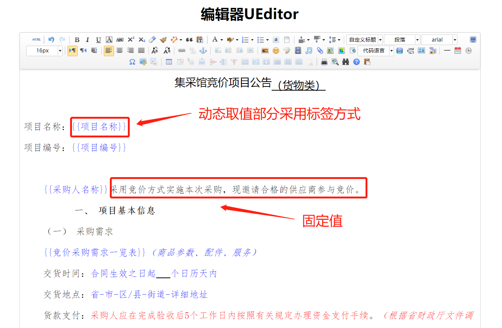
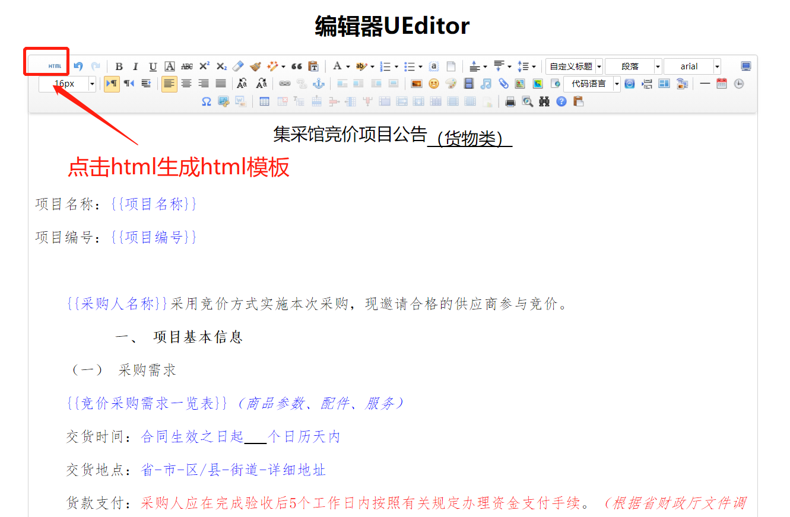
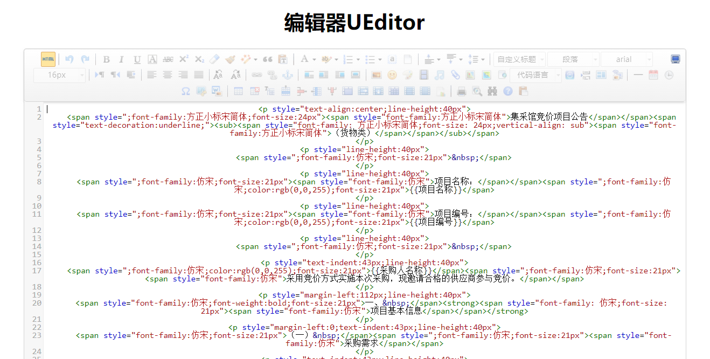
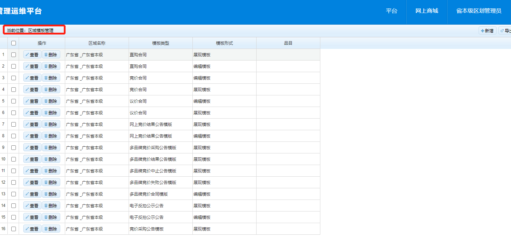

# 模板配置说明

## 1.关键字

合同模板、公告模板、模板配置

## 2.机制说明

电子卖场过程文档，包括合同模板、公告模板、合同公示模板等，采用富文本编辑器结合标签的方式生成，其中文档样式由富文本编辑器直接生成，动态取值部分由标签填充；

标签由开发制作并维护。

样例：

## 3.操作指南

### 3.1工具说明

富文本编辑器采用百度编辑器，在线地址http://www.vemmis.com/bjq/index.html；

该编辑器可有效还原word文档的样式。

标签样式：  {{标签内容}}

### 3.2模板编辑

模板可以使用word、wps等进行编辑，动态获取值采用标签填充。

### 3.3生成模板文件

点击html生成html模板。

### 3.4模板维护

将html文件维护到电子卖场中。

## 4.标签说明

| 模板类型 | 标签描述   | 标签名称               | 对应源码                                         |
| -------- | ---------- | ---------------------- | ------------------------------------------------ |
| 竞价     | 项目名称   | {{项目名称}}           | ${project.projectname?if_exists}                 |
| 竞价     | 项目编号   | {{项目编号}}           | ${project.projectcode?if_exists}                 |
| 竞价     | 采购人名称 | {{采购人名称}}         | ${project.orgname?if_exists}                     |
| 竞价     | 采购需求   | {{竞价采购需求一览表}} |                                                  |
| 竞价     | 交货时间   | {{天数}}               | ${project.deliveryperiod?if_exists}              |
| 竞价     | 交货地点   | {{地址}}               | ${project.deliveryaddress?if_exists}             |
| 竞价     | 预算金额   | {{采购预算}}           | ${project.buyplanmoney?if_exists?string("0.00")} |

